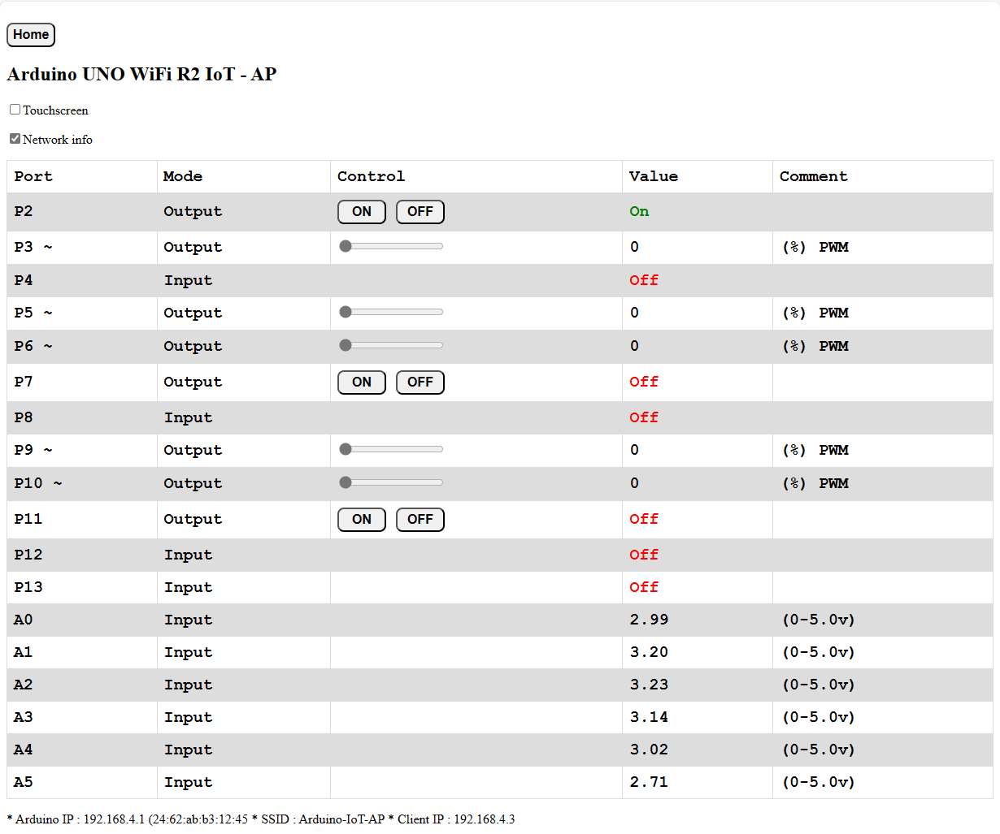

# Introduction

This software is made by me and used as an example when teaching my students IoT. It is made for the Arduino UNO WiFi R2 board and is programmed as AP. You must therefore Wi-Fi-connect directly to the Arduino and not via router/network. If you use touchscreen, make sure to check the touch-screen option on screen. Look at the documentation within the source-code for more information about how to adapt and use the software. The software is made with [Arduino IDE 2](https://www.arduino.cc/en/software).

Screenshot:
